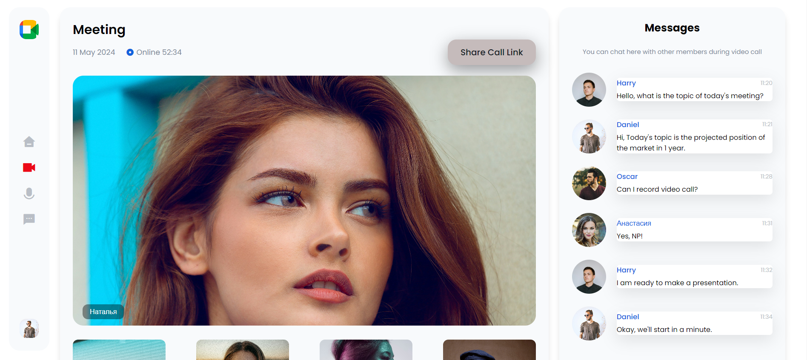

# Meeting Platform UI Design

This project involves the design of a user interface (UI) for a meeting platform. The platform allows users to organize online meetings, video conferences or chats.

## Project Description

The aim of this project is to design a user interface that will allow users to have a comfortable experience when using the meeting platform. The platform's functionality and user-friendly interface allows users to efficiently manage their meetings.

## Features

- User-friendly interface
- Home: Consists of a panel showing your meetings
- Meeting creation and participation functions
- Video and audio settings
- Chat window
- Screen sharing feature

## Usage

The project is quite simple to use. Simply download the relevant files and open them in a browser. Then, you can explore the functionalities offered by the platform.

## Screenshot
A screenshot of the project is given below.

You can reach my LinkedIn profile [here](https://www.linkedin.com/in/enesseri).